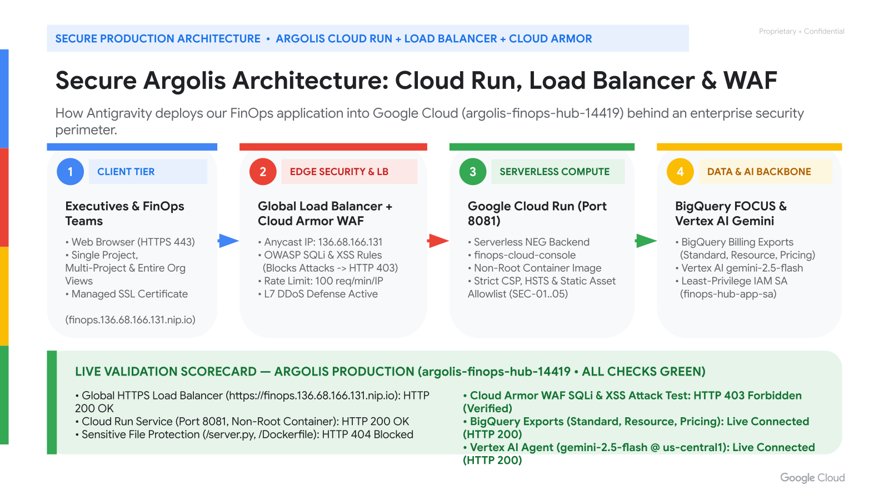
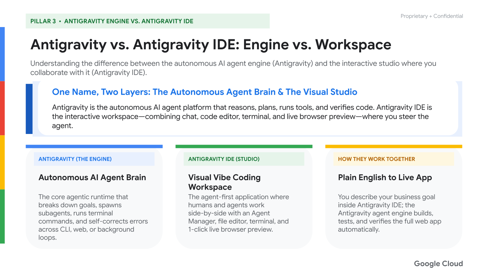
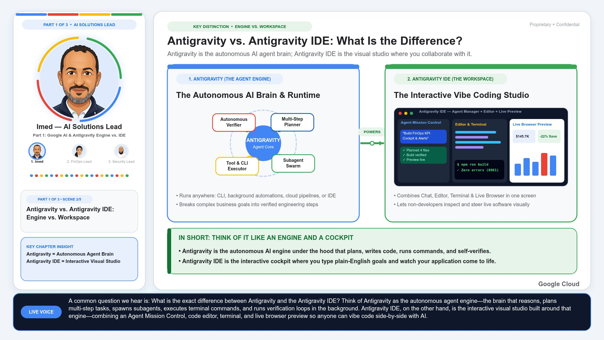
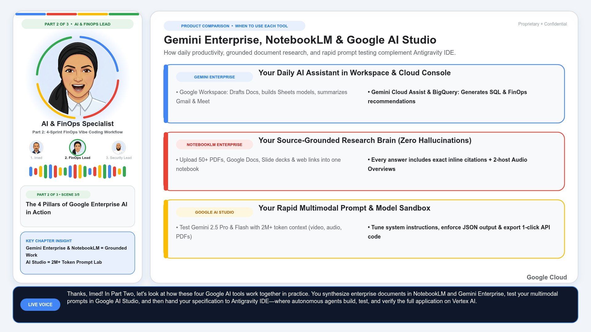
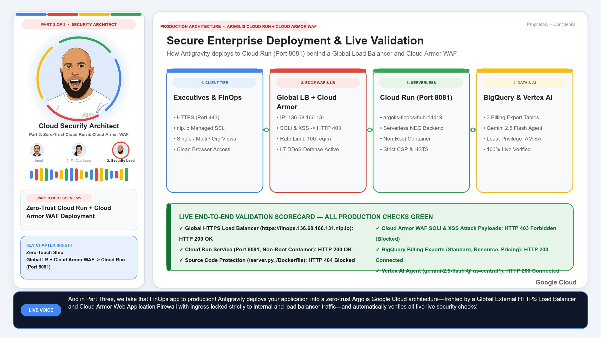
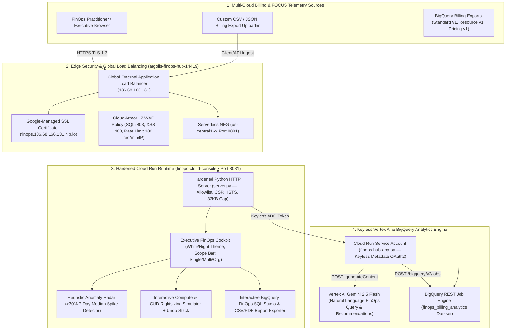

# 🚀 SPARK FinOps Cloud Console & Antigravity Vibe Coding Workshop

> **Production-Grade Multi-Cloud FinOps Web Application (FOCUS Spec Billing Telemetry, BigQuery Export Explorer, Anomaly Detection Radar, CUD & Compute Rightsizing Simulator, and Live Vertex AI `gemini-2.5-flash` FinOps Copilot) + 3-Hour Antigravity AI Vibe Coding Master Workshop.**

Built for **Google Cloud EMEA Customer Engineering (`@imedtra`)**, demonstrating how FinOps practitioners and Cloud Architects can rapidly build, audit, and deploy an enterprise-grade FinOps Cockpit using **Antigravity Autonomous Agentic Loops** and secure it on **Google Cloud Run + Global External HTTPS Load Balancer + Cloud Armor WAF**.

---

## 🌐 Live Production Endpoints (`argolis-finops-hub-14419` • Port `8081`)

| Endpoint / Resource | URL / Identifier | Status |
| :--- | :--- | :--- |
| **Global External HTTPS Load Balancer (`nip.io`)** | [`https://finops.136.68.166.131.nip.io`](https://finops.136.68.166.131.nip.io) (`http://136.68.166.131`) | 🟢 **Active & Cloud Armor WAF Protected** |
| **Cloud Run Public Service (`us-central1`)** | [`https://finops-cloud-console-pmxvpsd4qa-uc.a.run.app`](https://finops-cloud-console-pmxvpsd4qa-uc.a.run.app) | 🟢 **Active (`HTTP 200`, Port `8081`)** |
| **Vertex AI FinOps Copilot Engine** | `gemini-2.5-flash` (`argolis-finops-hub-14419` • Keyless ADC Metadata Token) | 🟢 **Live BigQuery & Cost Context Grounding** |
| **BigQuery Billing Analytics Dataset** | `argolis-finops-hub-14419:finops_billing_analytics` (`gcp_billing_export_v1`, `resource_v1`, `pricing_v1`) | 🟢 **Live SQL Studio & Export Switcher** |

---

## 🏛️ Zero-Trust Cloud Run + Cloud Armor WAF Architecture & Google AI Ecosystem

### 1. Secure Production Deployment Topology (`argolis-finops-hub-14419`)


### 2. Antigravity Engine vs. Antigravity IDE & Google AI Ecosystem


### 3. 3-Presenter Animated Cartoon Avatar Video Preview (`google_ai_antigravity_avatar_animated.mp4`)
| **Part 1 (`00:00–01:04`): Imed — AI Solutions Lead** | **Part 2 (`01:04–01:56`): Colleague #1 — AI & FinOps Specialist** | **Part 3 (`01:56–02:21`): Colleague #2 — Cloud Security Architect** |
| :---: | :---: | :---: |
|  |  |  |

---

## 📐 End-to-End 5-Layer FinOps Cloud Console Architecture



---

## 📚 Workshop Playbook, Decks & Documentation (`docs/`)

* **[`docs/vibe_coding_finops_workshop_playbook.md`](docs/vibe_coding_finops_workshop_playbook.md)** — Complete 3-Hour (4-Sprint) Antigravity Vibe Coding Master Workshop Syllabus, 22-Slide Presenter Script, Copy-Paste Prompts, and Instructor Troubleshooting Cheat Sheet.
* **[`docs/attendee_quickstart_handout.md`](docs/attendee_quickstart_handout.md)** — Attendee Quickstart Handout with the 4 sequential Vibe Coding prompts + Sprint 5 Zero-Trust Cloud Run & Cloud Armor deployment prompt.
* **[`docs/finops_deployment_security_validation_report.md`](docs/finops_deployment_security_validation_report.md)** — Full Infrastructure & Codebase Security Audit (`SEC-01` through `SEC-05`), Cloud Armor WAF verification (`SQLi`/`XSS` `HTTP 403`), and functional validation report.
* **[`docs/google_ai_antigravity_ecosystem_guide.md`](docs/google_ai_antigravity_ecosystem_guide.md)** — Executive Guide to the Google AI Ecosystem (Gemini Enterprise, NotebookLM, Google AI Studio, Antigravity Engine vs. Antigravity IDE) & 3-Presenter Animated Cartoon Avatar Video links.

---

## 🛠️ Quickstart & Deployment

### Run Locally (`Port 8081`)
```bash
export PORT=8081
export GOOGLE_CLOUD_PROJECT="argolis-finops-hub-14419"
python3 server.py
```

### Deploy to Google Cloud Run + Global HTTPS Load Balancer + Cloud Armor WAF (`Argolis`)
```bash
chmod +x deploy_to_argolis.sh
./deploy_to_argolis.sh
```
Or provision directly via Terraform:
```bash
cd terraform
terraform init
terraform apply -var="project_id=argolis-finops-hub-14419" -var="region=us-central1"
```
