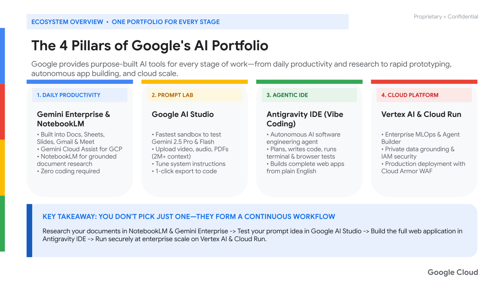
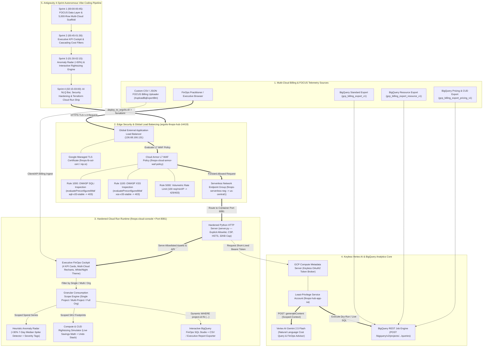
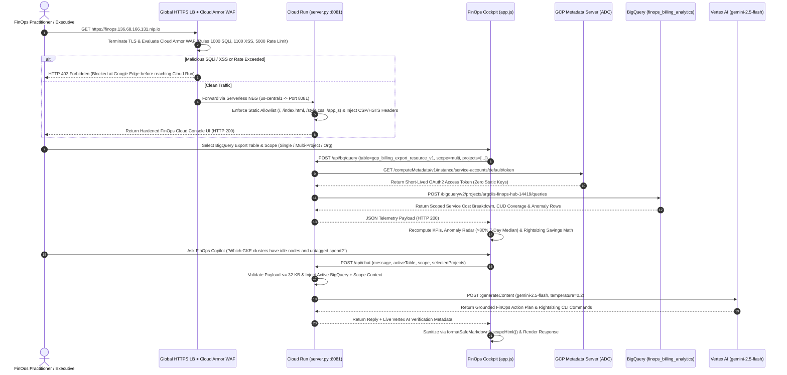

# SPARK FinOps Cloud Console & Antigravity Vibe Coding — Full System & Security Architecture

> [!NOTE]
> **Live Production Endpoints (`argolis-finops-hub-14419` • Port `8081`)**
> - **Global External HTTPS Load Balancer (Cloud Armor WAF Protected)**: `https://finops.136.68.166.131.nip.io` (`http://136.68.166.131`)
> - **Cloud Run Regional Service (`us-central1`)**: `https://finops-cloud-console-pmxvpsd4qa-uc.a.run.app`
> - **BigQuery Billing Analytics Dataset**: `argolis-finops-hub-14419:finops_billing_analytics` (`gcp_billing_export_v1`, `gcp_billing_export_resource_v1`, `gcp_billing_export_pricing_v1`)
> - **Keyless AI Engine**: Vertex AI `gemini-2.5-flash` (`us-central1-aiplatform.googleapis.com` via Cloud Run Service Account `finops-hub-app-sa@argolis-finops-hub-14419.iam.gserviceaccount.com`)
> - **GitHub Repository**: [`https://github.com/imedtra/spark-finops-vibe-coding`](https://github.com/imedtra/spark-finops-vibe-coding)

---

## 0. Official Google Cloud Architecture & Antigravity Ecosystem Schemas

````carousel

<!-- slide -->

<!-- slide -->

````

---

## 1. End-to-End 5-Layer System & Zero-Trust Cloud Architecture



---

## 2. Zero-Trust Cloud Armor WAF, BigQuery Export & Keyless Vertex AI Sequence



---

## 3. Architecture Layer & Google Cloud Resource Specifications

| Layer | Google Cloud Resource / Component | Identifier & Location | Key Responsibilities & Security Controls |
| :--- | :--- | :--- | :--- |
| **1. Global Edge & WAF** | Global External Application Load Balancer + Cloud Armor WAF | `finops-global-ip` (`136.68.166.131`)<br>`finops-cloud-armor-waf-policy` | Terminates HTTP/HTTPS (`finops-lb-ssl-cert`), enforces OWASP SQLi (`sqli-v33-stable` Rule `1000`), OWASP XSS (`xss-v33-stable` Rule `1100`), and IP rate-limiting (`100 req/min/IP` Rule `5000`). |
| **2. Serverless Routing** | Serverless Network Endpoint Group (NEG) | `finops-serverless-neg` (`us-central1`) | Bridges the Global External Load Balancer backend service (`finops-backend-service`) directly to the Cloud Run revision without public VM exposure. |
| **3. Container Runtime** | Cloud Run Gen2 Service (`Port 8081`) | `finops-cloud-console` (`us-central1`)<br>Image: `finops-repo/finops-cloud-console:latest` | Runs non-root `appuser` inside `python:3.11-slim` ([Dockerfile](file://assets/scratch/finops-cloud-console/Dockerfile)), serving [`server.py`](file://assets/scratch/finops-cloud-console/server.py) on `container_port = 8081`. |
| **4. Application Frontend** | FinOps Executive Cockpit & SQL Studio | [`index.html`](file://assets/scratch/finops-cloud-console/index.html), [`style.css`](file://assets/scratch/finops-cloud-console/style.css), [`app.js`](file://assets/scratch/finops-cloud-console/app.js) | Interactive KPI cards, Multi-Cloud Recharts, Granular Scope Selector (`Single` / `Multi-Project` / `Org`), Anomaly Radar, Rightsizing Simulator with Undo Stack, and BigQuery SQL Studio. |
| **5. Data Warehouse** | BigQuery Billing Analytics Dataset | `argolis-finops-hub-14419:finops_billing_analytics` | Hosts 3 normalized billing tables (`gcp_billing_export_v1`, `gcp_billing_export_resource_v1`, `gcp_billing_export_pricing_v1`) queried live via `/api/bq/query`. |
| **6. AI Intelligence** | Vertex AI Gemini 2.5 Flash | `projects/argolis-finops-hub-14419/locations/us-central1/publishers/google/models/gemini-2.5-flash` | Keyless ADC inference via `finops-hub-app-sa` powering the Natural Language FinOps Query Bar and interactive Gemini FinOps Copilot drawer (`/api/chat`). |
| **7. Infrastructure as Code** | Modular Terraform Blueprints | [`terraform/main.tf`](file://assets/scratch/finops-cloud-console/terraform/main.tf), [`cloud_run.tf`](file://assets/scratch/finops-cloud-console/terraform/cloud_run.tf), [`load_balancer.tf`](file://assets/scratch/finops-cloud-console/terraform/load_balancer.tf), [`cloud_armor.tf`](file://assets/scratch/finops-cloud-console/terraform/cloud_armor.tf) | Declarative provisioning of APIs, least-privilege Service Account IAM, Cloud Run v2, Serverless NEG, Global External Load Balancer, Managed SSL, and Cloud Armor WAF. |

---

## 4. REST API & Telemetry Contracts (`server.py`)

| Endpoint | Method | Request Payload / Parameters | Response Contract & Behavior |
| :--- | :---: | :--- | :--- |
| `/`, `/index.html`, `/style.css`, `/app.js` | `GET` | None (Strict Static Allowlist) | Serves the FinOps Cloud Console static bundle with `Content-Security-Policy`, `Strict-Transport-Security`, `X-Content-Type-Options: nosniff`, and `X-Frame-Options: DENY`. Any non-allowlisted path (`/server.py`, `/Dockerfile`, `/terraform/*`) returns `HTTP 404`. |
| `/api/health` | `GET` | None | Returns `{"status": "ok", "service": "finops-cloud-console", "project": "argolis-finops-hub-14419", "model": "gemini-2.5-flash"}` for Cloud Load Balancer health checks and smoke tests. |
| `/api/bq/query` | `POST` | `{"table": "gcp_billing_export_v1 \| gcp_billing_export_resource_v1 \| gcp_billing_export_pricing_v1", "scope": "single \| multi \| org", "projects": ["..."]}` | Executes a parameterized BigQuery query against `argolis-finops-hub-14419:finops_billing_analytics.<table_name>` using keyless ADC OAuth2 and returns service-level spend, CUD coverage, and anomaly telemetry. |
| `/api/chat` | `POST` | `{"message": "...", "context": {"table": "...", "scope": "...", "projects": [...]}}` (Max `32 KB`) | Calls Vertex AI `gemini-2.5-flash:generateContent` with live FinOps system instructions grounded in the user's selected BigQuery export table and project scope. |

---

## 5. Defense-in-Depth Security Controls Matrix

| Control Layer | Control ID | Threat Mitigated | Implementation Details |
| :--- | :---: | :--- | :--- |
| **Edge WAF (Cloud Armor)** | `WAF-1000` | SQL Injection (`OWASP A03`) | `evaluatePreconfiguredWaf('sqli-v33-stable')` blocks SQLi in query parameters, headers, or body with `HTTP 403`. |
| **Edge WAF (Cloud Armor)** | `WAF-1100` | Cross-Site Scripting (`OWASP A03`) | `evaluatePreconfiguredWaf('xss-v33-stable')` blocks reflected/stored XSS payloads at Google's edge with `HTTP 403`. |
| **Edge WAF (Cloud Armor)** | `WAF-5000` | L7 Volumetric DDoS & Scraping | Rate-based ban (`100 requests / 60s` per client IP; `300s` ban duration) returning `HTTP 429/403`. |
| **HTTP Server (`server.py`)** | `SEC-01` | Source & IaC Disclosure (`CWE-548`) | Replaced `SimpleHTTPRequestHandler` with `BaseHTTPRequestHandler` and a strict 4-file allowlist (`/`, `/index.html`, `/style.css`, `/app.js`). |
| **Frontend DOM (`app.js`)** | `SEC-02` | DOM XSS in AI Chat (`CWE-79`) | `formatSafeMarkdown()` runs `escapeHtml()` on all Vertex AI responses before rendering markdown tags. |
| **HTTP Headers (`server.py`)** | `SEC-03` | Clickjacking, MIME Sniffing & MITM | Enforces `Strict-Transport-Security: max-age=31536000; includeSubDomains`, `Content-Security-Policy`, `X-Frame-Options: DENY`, and `Cross-Origin-Opener-Policy: same-origin`. |
| **Payload Guard (`server.py`)** | `SEC-04` | Memory Exhaustion DoS (`CWE-400`) | Rejects POST bodies larger than `MAX_BODY_BYTES = 32768` (`32 KB`) with `HTTP 413 Payload Too Large`. |
| **Container & IAM (`Dockerfile`, `main.tf`)** | `SEC-05` | Privilege Escalation & Over-Privileged SA | Runs as non-root `appuser` (`chmod 440/550`), copies only runtime files, and binds `finops-hub-app-sa` strictly to `roles/aiplatform.user`, `roles/bigquery.jobUser`, and `roles/bigquery.dataViewer`. |

---

## 6. `go/genarch` (`https://genarch.corp.goog`) Specification & Prompt

```text
NODES:
- Multi-Cloud Billing Sources: BigQuery Standard Export (gcp_billing_export_v1), Resource Export (gcp_billing_export_resource_v1), Pricing Export (gcp_billing_export_pricing_v1), Custom FOCUS CSV/JSON
- Global Edge Security: Global External HTTPS Load Balancer (136.68.166.131), Google-Managed SSL Certificate, Cloud Armor WAF Policy (SQLi Rule 1000, XSS Rule 1100, Rate Limit Rule 5000)
- Serverless Compute (us-central1): Serverless NEG, Cloud Run Service (finops-cloud-console on Port 8081), Hardened Python HTTP Server (server.py)
- FinOps Cockpit Modules: Granular Scope Engine (Single/Multi/Org), Executive KPI Cards, Anomaly Detection Radar (>30% 7-Day Median), Compute & CUD Rightsizing Simulator, BigQuery SQL Studio
- AI & Analytics Core: Least-Privilege Service Account (finops-hub-app-sa), GCP Metadata Server (Keyless ADC), Vertex AI Gemini 2.5 Flash, BigQuery Analytics Dataset (finops_billing_analytics)

EDGES:
- FinOps Practitioner -> Global External HTTPS Load Balancer: HTTPS TLS 1.3
- Global External HTTPS Load Balancer -> Cloud Armor WAF Policy: Inspect L7 SQLi, XSS & Rate Limit
- Cloud Armor WAF Policy -> Serverless NEG: Route Permitted Traffic
- Serverless NEG -> Cloud Run Service (finops-cloud-console): Forward to Port 8081
- Cloud Run Service -> GCP Metadata Server: Acquire Keyless OAuth2 Token
- Cloud Run Service -> BigQuery Analytics Dataset: Parameterized SQL Queries (/api/bq/query)
- Cloud Run Service -> Vertex AI Gemini 2.5 Flash: Grounded FinOps Chat & NLQ (/api/chat)
```
