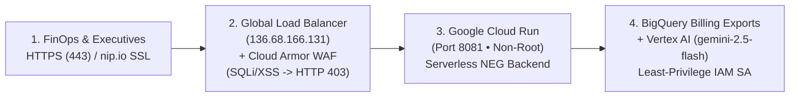

# Attendee Quick-Start Lab Handout (4-Sprint Cadence)
## Vibe Coding FinOps: 3-Hour Master Workshop with Antigravity AI Agents

> [!TIP]
> **How the 4-Sprint Cadence Works (4 × 45 Minutes)**
> Each 45-minute sprint combines **30 minutes of FinOps architecture & concept review** with a **15-minute autonomous Antigravity build** triggered by pasting one of the prompts below.

---

### Step 0 (00:25): Create `AGENTS.md` in Your Project Root

Paste this prompt (or save as `AGENTS.md`) before starting Sprint 1 so Antigravity enforces FOCUS v1.0 normalization and 100% mathematical reconciliation:

```markdown
# AGENTS.md — FinOps Vibe Coding Architectural Guardrails

## 1. Domain & Data Model Rules (FOCUS v1.0 Standard)
- Normalize all billing records to FOCUS v1.0: `id`, `usageDate`, `provider` ('GCP' | 'AWS' | 'Azure'), `billingAccountId`, `projectId`, `projectName`, `costCenter` ('Engineering' | 'Data Science' | 'Infrastructure' | 'Security'), `environment` ('prod' | 'staging' | 'dev'), `serviceName` ('Compute' | 'Cloud Storage' | 'BigQuery' | 'RDS' | 'GKE' | 'Vertex AI'), `skuDescription`, `region`, `billedCostUsd`, `effectiveCostUsd`, `usageQuantity`, `usageUnit`, `tags`, `isTagged`.
- Always display BOTH the human-readable `projectName` and `projectId` in project pickers, filters, and tables.
- Support 3 Granular Scopes: Single Project (`single`), Multiple Selected Projects (`multi`), and Entire Organization (`org`).

## 2. Mathematical Reconciliation Invariant
- KPI summary cards, Recharts visualizations, and table totals MUST derive from the exact same filtered dataset and reconcile 100% to the cent. Use a deterministic seeded generator so Next.js SSR and client renders never mismatch.

## 3. UI & Quality Guardrails
- Follow the Google Cloud Console Dark & Light Theme aesthetic.
- Declare all stateful/chart variables at the top of scope before initialization hooks.
- Every sprint MUST pass `npm run build` with zero errors.
```

---

### Sprint 1 (Trigger at 00:30) | Foundations, FOCUS Spec & Scaffolding

```markdown
Initialize a Next.js 14 project using Tailwind CSS and TypeScript (configured to serve on port 8081 for Google Cloud Run compatibility). Create a FinOps data layer ingesting multi-cloud billing records normalized to the FOCUS v1.0 standard as defined in AGENTS.md. Generate a realistic, deterministic mock dataset containing 5,000 line items across 4 cost centers (Engineering, Data Science, Infrastructure, Security) and multiple named projects (including Argolis FinOps Hub, HTR Core Production, HTR GKE Platform, HTR Data Warehouse, and Entire Organization rollup) covering Compute, Cloud Storage, BigQuery, and RDS across GCP, AWS, and Azure. Verify that the build passes with zero errors.
```

---

### Sprint 2 (Trigger at 01:15) | Cost Visibility & Executive Dashboards

```markdown
Build a responsive FinOps Executive Cockpit on the existing FOCUS data models. Include:
1. A top global header with a searchable Project & Organization Picker proposing human-readable Project Names + IDs (Single Project, Multiple Projects, and Entire Organization scope) and a Dark/Light theme toggle following the Google Cloud Console aesthetic.
2. A left collapsible navigation rail switching cleanly between Cockpit Overview, Cost Breakdown, Anomaly & Rightsizing Engine, and BigQuery/FOCUS SQL Studio.
3. 4 KPI summary cards (MTD Spend, Projected Run-rate vs. Budget, Efficiency Score, and Untagged Spend $) that dynamically recalculate from the active filter state.
4. An interactive spend-over-time multi-cloud chart with provider toggles (GCP, AWS, Azure) and a Cost by Service breakdown chart using Recharts, plus cascading filter controls by Cost Center, Project/Org Scope, and Environment (prod, staging, dev).
Verify that all navigation links, dropdowns, and charts render with zero console or build errors.
```

---

### Sprint 3 (Trigger at 02:00) | Anomaly Radar & Rightsizing Engine

```markdown
Implement an automated Cost Optimization Engine synchronized with the active Cost Center and Project/Organization scope:
1. Anomaly Radar: Calculate the 7-day rolling median per service and cost center, and flag daily cost spikes >30% over the 7-day median with severity tags (Critical >50%, High 35–50%, Medium 30–35%), root-cause SKU details, and a 1-click "Inspect" action.
2. Rightsizing & CUD Table: Display resource name, project name + ID, Cost Center, current SKU (e.g., m5.2xlarge, n2-standard-8, unattached SSD volume, PayGo Vertex AI), proposed SKU / 3-Year CUD action, copyable CLI remediation command, and monthly/annual savings with an interactive "Simulate Savings" toggle that live-updates the Executive KPI Projected Run-rate and Efficiency Score.
3. Add a one-click "Export CSV" button to download the active optimization and billing plan as a timestamped CSV file.
```

---

### Sprint 4 (Trigger at 02:35) | Natural Language Cost Query & Live Ship

```markdown
Add an AI Natural Language Query Bar at the top of the portal (connected to Vertex AI Gemini / deterministic NL-to-filter parser) that translates natural language prompts (e.g., "Which team spent the most on BigQuery?", "Show critical anomalies in Engineering", "What are our top savings in Organization scope?") into live filtered dashboard views and an executive AI insight summary banner with 1-click sample prompt chips. Run full verification tests across all buttons and tabs, eliminate any hydration or lint errors, add smooth loading skeletons, and ensure `npm run build` (and Cloud Run port 8081 deployment readiness) succeeds cleanly.
```

---

### Production Ship (Trigger at 02:45) | Secure Argolis Cloud Run + Load Balancer + Cloud Armor WAF

```markdown
Deploy the FinOps application to Google Cloud Run in project argolis-finops-hub-14419 on port 8081 using a least-privilege service account (finops-hub-app-sa) bound only to BigQuery Data Viewer, BigQuery Job User, and Vertex AI User. Provision a Global External Application Load Balancer (136.68.166.131) with a Google-managed SSL certificate (finops.136.68.166.131.nip.io) routing via a Serverless NEG to Cloud Run, and attach a Google Cloud Armor WAF policy (finops-cloud-armor-waf-policy) enforcing OWASP SQLi (Rule 1000), OWASP XSS (Rule 1100), Rate Limiting (100 req/min/IP), and L7 DDoS defense. Finally, execute an end-to-end validation confirming HTTP 200 on all health/UI endpoints, HTTP 403 Forbidden on SQLi/XSS attack payloads, HTTP 404 on source files (/server.py, /Dockerfile), and live connectivity to BigQuery and Vertex AI (gemini-2.5-flash).
```

---

### Target Production Architecture Schema (`argolis-finops-hub-14419`)



---

### Sprint & Production Verification Checklist
- [x] **Sprint 1 (00:45)**: `AGENTS.md` created, 5,000 FOCUS records generated across 4 Cost Centers (`Engineering`, `Data Science`, `Infrastructure`, `Security`), zero build errors.
- [x] **Sprint 2 (01:30)**: 4 KPI cards (`MTD Spend`, `Projected Run-rate`, `Efficiency Score`, `Untagged Spend`), Recharts provider toggles, Project Picker showing **Project Names + IDs**, and cascading Cost Center / Environment / Org filters working.
- [x] **Sprint 3 (02:15)**: Anomaly Radar flagging `>30%` spikes (`Critical`, `High`, `Medium`), Rightsizing `"Simulate Savings"` toggle dynamically updating KPIs, and CSV export downloading cleanly.
- [x] **Sprint 4 (02:45)**: Natural Language Query Bar filtering views on plain-English queries, loading skeletons active, and `npm run build` succeeding with zero errors.
- [x] **Production Ship (03:00)**: Global HTTPS Load Balancer (`https://finops.136.68.166.131.nip.io`) returning `HTTP 200 OK`, Cloud Armor WAF blocking SQLi/XSS with `HTTP 403 Forbidden`, Cloud Run running on Port `8081`, and BigQuery + Vertex AI `gemini-2.5-flash` live connected.

