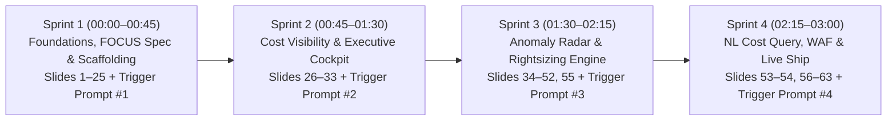
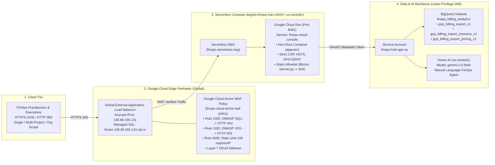

# Antigravity Master Workshop Blueprint: 3-Hour FinOps Vibe Coding
### Executive FinOps Architect & Lead AI Systems Instructor Playbook

> [!IMPORTANT]
> **Master Cadence & Deck Integration**
> - **Workshop Format**: **4-Sprint Cadence Architecture** (4 × 45-minute stages = 180 minutes). Every sprint pairs **30 minutes of conceptual FinOps instruction** (using the **Cloud FinOps - June26** deck) with a **15-minute autonomous Antigravity background run** triggered by a copy-paste prompt.
> - **Core Curriculum Deck**: Integrated directly with **Cloud FinOps - June26** (`Slides 1–63`: *Inform → Optimize → Operate*, *FOCUS v1.0 BigQuery Export*, *Unit Economics*, *CUDs*, *FinOps Hub*, *Active Assist*, and *Gemini Cloud Assist*).
> - **Live Production Reference**: Project `argolis-finops-hub-14419` | Global Load Balancer + Cloud Armor WAF (`http://136.68.166.131` / `https://finops.136.68.166.131.nip.io`) | Cloud Run (`PORT=8081`).

---

## 1. The 4-Sprint Cadence Architecture & Slide-by-Slide Timeline (180 Minutes)



---

### Sprint 1 (00:00 – 00:45) | Foundations, FOCUS Spec & Scaffolding

#### A. Conceptual Lecture (00:00 – 00:30) — *Mapping to "Cloud FinOps - June26" (Slides 1–25)*
| Time | Slides (`Cloud FinOps - June26`) | Topic & Instructor Delivery | Key Takeaway for Attendees |
| :--- | :--- | :--- | :--- |
| **00:00–00:08** | **Slides 1–6**: *FinOps Priorities & Framework (Inform, Optimize, Operate)* | Introduce the 3 core FinOps questions (*How do I visualize spend? Eliminate waste? Incentivize accountability?*) and why traditional 6-week internal engineering sprints fail to keep pace with cloud consumption. | FinOps is a cultural + operational loop (*Inform → Optimize → Operate*) accelerated 100x by Agentic Vibe Coding. |
| **00:08–00:18** | **Slides 7–15**: *INFORM, DIKW Pyramid & GCP Resource Hierarchy* | Walk through the **FinOps DIKW Pyramid** (*Raw Billing Data → Wisdom*) and Google Cloud Resource Hierarchy (`Organization → Folders → Billing Account → Projects → Labels/Tags`). Explain why executives need to pivot seamlessly between *Single Project*, *Multi-Project Portfolio*, and *Entire Organization* (`$145,763.10/mo`). | Clean hierarchy + mandatory labels (`env`, `team`, `cost-center`) are the foundation of cost allocation. |
| **00:18–00:25** | **Slides 16–25**: *Native Tools, BigQuery Billing Export & FOCUS v1.0 Spec* | Deep dive into **Slide 21 & Slide 25**: Standard Billing Export (`gcp_billing_export_v1`), Detailed Resource Export (`gcp_billing_export_resource_v1`), Pricing Export, and the **FOCUS v1.0** (*FinOps Open Cost and Usage Specification*) multi-cloud normalization standard across GCP, AWS, and Azure. | Normalization to FOCUS v1.0 allows a single application to ingest GCP BigQuery, AWS CUR, and Azure Cost exports. |
| **00:25–00:30** | **Live Demo**: *Authoring `AGENTS.md` — The Agent's Constitutional Rules* | Show how `AGENTS.md` locks in architectural invariants (TypeScript strictness, FOCUS schema fields, human-readable Project Names + IDs, and 100% reconciliation between KPI cards and table totals) before issuing the first prompt. | `AGENTS.md` prevents agent hallucinations and enforces enterprise guardrails automatically. |

#### B. Autonomous Agent Run #1 (00:30 – 00:45)
- **At 00:30 — Issue Trigger Prompt #1** (see Section 2 below).
- **00:30–00:40 ("While the Agent Works" Instructor Bridge)**:
  - Walk attendees through the live terminal as Antigravity initializes Next.js 14 + Tailwind CSS + TypeScript, builds the FOCUS data normalization layer, and generates the 5,000-line multi-cloud dataset across `Engineering`, `Data Science`, `Infrastructure`, and `Security`.
  - Address the **Seeded vs. Live Billing Export** distinction: explain why we seed 5,000 realistic FOCUS records on Day 1 (since a brand-new sandbox project has only ~$1–$2/day of spend and native BigQuery exports take 24–48h to backfill).
- **00:40–00:45 — Sprint 1 Verification Checkpoint**:
  - Confirm `npm run build` / server startup passes with zero errors and inspect the typed FOCUS data model.

---

### Sprint 2 (00:45 – 01:30) | Cost Visibility & Executive Dashboards (`INFORM`)

#### A. Conceptual Lecture (00:45 – 01:15) — *Mapping to "Cloud FinOps - June26" (Slides 26–33)*
| Time | Slides (`Cloud FinOps - June26`) | Topic & Instructor Delivery | Key Takeaway for Attendees |
| :--- | :--- | :--- | :--- |
| **00:45–00:55** | **Slides 26–27**: *Customer Personas & Executive Cockpit Design* | Map the 5 FinOps Personas (*Executives, Product Owners, Architects, Engineering/DevOps, IT Finance*) to specific cockpit views: Executive Summary, Top Cost Categories, Labeling Compliance, Showback/Chargeback, and CUD Coverage. | Different personas need different lenses on the same underlying BigQuery/FOCUS dataset. |
| **00:55–01:05** | **Slides 28–29**: *Budgets, Alerts & Quota Cost Controls* | Explain proactive threshold governance: setting monthly budget alerts (50%, 80%, 100% of forecasted vs. actual spend) and service-specific quota limits to prevent runaway BigQuery or GPU spend. | Budgets inform; quotas enforce. Both belong on the Executive Cockpit. |
| **01:05–01:15** | **Slides 30–33**: *Unit Economics, Value Management & GreenOps* | *"If you can't measure it, you can't improve it."* Teach how to correlate variable cloud spend (`$90k–$145k/mo`) to business value metrics (`$0.25 per customer order`, CSAT lift, DORA/SRE metrics, and carbon footprint). | Shift the conversation from *"Cloud costs too much"* to *"Cloud cost per transaction improved 14%."* |

#### B. Autonomous Agent Run #2 (01:15 – 01:30)
- **At 01:15 — Issue Trigger Prompt #2** (see Section 2 below).
- **01:15–01:25 ("While the Agent Works" Instructor Bridge)**:
  - Explain how Antigravity wires the 4 Executive KPI Cards (`MTD Spend`, `Projected Run-rate`, `Efficiency Score`, `Untagged Spend`), the multi-cloud Recharts spend-over-time visualization, and cascading filter controls (`Cost Center`, `Environment`, and `Single Project / Multi-Project / Entire Organization` scope).
  - Highlight why we require the Project Picker to display **Human-Readable Project Names alongside Project IDs** (e.g., *Argolis FinOps Hub (`argolis-finops-hub-14419`)*).
- **01:25–01:30 — Sprint 2 Verification Checkpoint**:
  - Test the live Executive Cockpit in Google Cloud Console Dark/Light theme, toggle providers (GCP, AWS, Azure) on the spend chart, and pivot between Cost Centers and Organization scope.

---

### Sprint 3 (01:30 – 02:15) | Anomaly Radar & Rightsizing Engine (`OPTIMISE`)

#### A. Conceptual Lecture (01:30 – 02:00) — *Mapping to "Cloud FinOps - June26" (Slides 34–52 & 55)*
| Time | Slides (`Cloud FinOps - June26`) | Topic & Instructor Delivery | Key Takeaway for Attendees |
| :--- | :--- | :--- | :--- |
| **01:30–01:40** | **Slides 34–36**: *OPTIMISE: Product vs. Pricing Efficiency & Effort/Savings Matrix* | Walk through **Slide 36 (Where are the cost savings?)**: prioritize **Low Effort / High Savings** wins first—Idle Resources, Storage Lifecycle Management, Post-Deployment Rightsizing, Autoscaling, and Committed Use Discounts (CUDs). | Attack zero-risk waste (unattached disks, zombie VMs) first to fund deeper architectural modernization. |
| **01:40–01:50** | **Slides 37–44**: *Tips #1–#8: Serverless, Machine Types, Storage, BigQuery & ML* | Cover concrete technical levers: Cloud Run scale-to-zero (**Slide 37**), Machine series selection E/N/C/G/A/TPU (**Slide 38**), Storage Autoclass/Archive, BigQuery Partitioning/Clustering + Slot Recommender (**Slide 43**), and ML inference quantization (**Slide 44**). | Understand the exact SKU transformations (`m5.2xlarge` → `m6i.xlarge`, `n2-standard-8` → `e2-standard-4`) our Rightsizing Engine will simulate. |
| **01:50–02:00** | **Slides 45–52 & 55**: *CUDs Decision Tree, FinOps Hub & Active Assist* | Walk through the **Slide 47 Decision Tree** (*Stateless? → Spot VMs; Commit 1–3 yrs? → CUDs*), **FinOps Hub** (**Slides 48–52**), and **Active Assist** (**Slide 55**: Downsize VM, Idle VM, Detached Disks, Unattended Projects). | Combine engineering utilization telemetry (<18% CPU) with commitment economics (57% 3-Yr CUD discount). |

#### B. Autonomous Agent Run #3 (02:00 – 02:15)
- **At 02:00 — Issue Trigger Prompt #3** (see Section 2 below).
- **02:00–02:10 ("While the Agent Works" Instructor Bridge)**:
  - Explain the statistical logic Antigravity is generating:
    1. **Anomaly Radar**: Computing the 7-day rolling median per service/cost-center and flagging daily spikes `>30%` with `Critical` (>50%), `High` (35–50%), and `Medium` (30–35%) badges.
    2. **Rightsizing & CUD Simulator**: Interactive toggles that dynamically subtract simulated savings from the Projected Run-Rate KPI and generate a downloadable CSV optimization plan.
- **02:10–02:15 — Sprint 3 Verification Checkpoint**:
  - Inspect flagged anomalies, toggle `"Simulate Savings"` on 3 rightsizing rows, watch the KPI cards recalculate in real time, and export the CSV optimization plan.

---

### Sprint 4 (02:15 – 03:00) | Natural Language Cost Query & Live Ship (`OPERATE`)

#### A. Conceptual Lecture (02:15 – 02:35) — *Mapping to "Cloud FinOps - June26" (Slides 53–54 & 56–63)*
| Time | Slides (`Cloud FinOps - June26`) | Topic & Instructor Delivery | Key Takeaway for Attendees |
| :--- | :--- | :--- | :--- |
| **02:15–02:23** | **Slides 53–54**: *Gemini Cloud Assist for FinOps & AI-Driven Operations* | Showcase how **Gemini Cloud Assist for FinOps** (**Slide 53**) enables stakeholders to ask natural-language business questions (*"Which team spent the most on BigQuery?"*) and receive grounded, cited answers backed by deterministic billing data. | LLMs should never guess math—they should translate natural language into deterministic filters/SQL and summarize verified results. |
| **02:23–02:30** | **Slides 56–60**: *OPERATE: Financial Governance, 6 Best Practices & Crawl-Walk-Run Roadmap* | Review the **6 Golden Best Practices** (**Slide 58**: Labels, Day-1 BQ Export, Project Boundaries, Cost Reporting over Invoices, Budget/Quota Alerts, Folder Hierarchy) and the **Crawl → Walk → Run Roadmap** (**Slide 60**). | Sustainable FinOps requires embedding cost visibility directly into daily engineering & executive workflows. |
| **02:30–02:35** | **Live Case Study**: *Conversational Verification Loops & DevSecOps Hardening* | Share the real-world production debugging pattern: how to instruct Antigravity to eliminate hydration/TDZ errors, verify 100% button coverage, containerize on port `8081`, and deploy behind **Google Cloud Run + Cloud Armor WAF**. | Non-developers can run full QA, build verification, and WAF hardening via conversational loops. |

#### B. Autonomous Agent Run #4 & Live Ship (02:35 – 03:00)
- **At 02:35 — Issue Trigger Prompt #4** (see Section 2 below).
- **02:35–02:48 ("While the Agent Works" Instructor Bridge)**:
  - Watch Antigravity wire the top **AI Natural Language Query Bar**, add loading skeletons, run `npm run build` / lint verification, and deploy the container to Google Cloud Run (`argolis-finops-hub-14419` behind `http://136.68.166.131`).
- **02:48–03:00 — Live Production Ship, WAF Test & Executive Wrap-Up (Slides 61–63)**:
  - Type natural language queries into the live portal (*"Which team spent the most on BigQuery?"*, *"Show critical anomalies in Engineering"*).
  - Run the live Cloud Armor WAF check (`HTTP 200` on normal traffic; `HTTP 403` on SQLi/XSS).
  - Close with the **Slide 62 Call-to-Action Discovery Questions** and hand out the Monday-Morning Rollout Kit.

---

## 2. Constitutional `AGENTS.md` & Copy-Paste Trigger Prompts (#1 – #4)

### Pre-Sprint Setup: `AGENTS.md` (Created During Sprint 1 Lecture at 00:25)

Instruct attendees to ask Antigravity to create (or paste) this `AGENTS.md` file in the workspace root so every subsequent sprint automatically obeys strict FinOps and UI guardrails:

```markdown
# AGENTS.md — FinOps Vibe Coding Architectural Guardrails

## 1. Domain & Data Model Rules (FOCUS v1.0 Standard)
- All cloud billing records MUST conform to the FinOps Open Cost and Usage Specification (FOCUS v1.0) normalized schema:
  - `id`, `usageDate`, `provider` ('GCP' | 'AWS' | 'Azure'), `billingAccountId`, `projectId`, `projectName`, `costCenter` ('Engineering' | 'Data Science' | 'Infrastructure' | 'Security'), `environment` ('prod' | 'staging' | 'dev'), `serviceName` ('Compute' | 'Cloud Storage' | 'BigQuery' | 'RDS' | 'GKE' | 'Vertex AI'), `skuDescription`, `region`, `billedCostUsd`, `effectiveCostUsd`, `usageQuantity`, `usageUnit`, `tags` (Record<string, string>), `isTagged` (boolean).
- Always display BOTH the human-readable `projectName` and `projectId` in project pickers, filters, and breakdown tables.
- Support 3 Granular Consumption Scopes: Single Project (`single`), Multiple Selected Projects (`multi`), and Entire Organization (`org`).

## 2. Mathematical Reconciliation Invariant
- Whenever filters, scopes (`single` / `multi` / `org`), date ranges, or rightsizing simulations change, the top KPI summary cards, all Recharts visualizations, and the Breakdown/Rightsizing table totals MUST recalculate from the exact same filtered dataset so numbers reconcile 100% to the cent.
- Never use LLMs to hallucinate arithmetic; perform all aggregations deterministically in TypeScript/SQL and pass verified totals to the AI query bar.

## 3. UI, Theme & Code Quality Guardrails
- Follow the Google Cloud Console Dark & Light Theme aesthetic (`#0f172a` / `#1e293b` dark surfaces, `#1a73e8` primary blue, `#34a853` savings green, `#fbbc04` warning amber, `#ea4335` critical red).
- Declare all stateful/chart variables at the top of scope before initialization hooks to prevent Temporal Dead Zone (TDZ) ReferenceErrors or React hydration mismatches.
- Every sprint MUST pass `npm run build` (or syntax/type verification) with zero errors before completion.
```

---

### Trigger Prompt #1 (Sprint 1 — Issue at 00:30)
> **Copy-Paste into Antigravity:**
```markdown
Initialize a Next.js 14 project using Tailwind CSS and TypeScript (configured to serve on port 8081 for Google Cloud Run compatibility). Create a FinOps data layer ingesting multi-cloud billing records normalized to the FOCUS v1.0 standard as defined in AGENTS.md. Generate a realistic, deterministic mock dataset containing 5,000 line items across 4 cost centers (Engineering, Data Science, Infrastructure, Security) and multiple named projects (including Argolis FinOps Hub, HTR Core Production, HTR GKE Platform, HTR Data Warehouse, and Entire Organization rollup) covering Compute, Cloud Storage, BigQuery, and RDS across GCP, AWS, and Azure. Verify that the build passes with zero errors.
```

---

### Trigger Prompt #2 (Sprint 2 — Issue at 01:15)
> **Copy-Paste into Antigravity:**
```markdown
Build a responsive FinOps Executive Cockpit on the existing FOCUS data models. Include:
1. A top global header with a searchable Project & Organization Picker proposing human-readable Project Names + IDs (Single Project, Multiple Projects, and Entire Organization scope) and a Dark/Light theme toggle following the Google Cloud Console aesthetic.
2. A left collapsible navigation rail switching cleanly between Cockpit Overview, Cost Breakdown, Anomaly & Rightsizing Engine, and BigQuery/FOCUS SQL Studio.
3. 4 KPI summary cards (MTD Spend, Projected Run-rate vs. Budget, Efficiency Score, and Untagged Spend $) that dynamically recalculate from the active filter state.
4. An interactive spend-over-time multi-cloud chart with provider toggles (GCP, AWS, Azure) and a Cost by Service breakdown chart using Recharts, plus cascading filter controls by Cost Center, Project/Org Scope, and Environment (prod, staging, dev).
Verify that all navigation links, dropdowns, and charts render with zero console or build errors.
```

---

### Trigger Prompt #3 (Sprint 3 — Issue at 02:00)
> **Copy-Paste into Antigravity:**
```markdown
Implement an automated Cost Optimization Engine synchronized with the active Cost Center and Project/Organization scope:
1. Anomaly Radar: Calculate the 7-day rolling median per service and cost center, and flag daily cost spikes >30% over the 7-day median with severity tags (Critical >50%, High 35–50%, Medium 30–35%), root-cause SKU details, and a 1-click "Inspect" action.
2. Rightsizing & CUD Table: Display resource name, project name + ID, Cost Center, current SKU (e.g., m5.2xlarge, n2-standard-8, unattached SSD volume, PayGo Vertex AI), proposed SKU / 3-Year CUD action, copyable CLI remediation command, and monthly/annual savings with an interactive "Simulate Savings" toggle that live-updates the Executive KPI Projected Run-rate and Efficiency Score.
3. Add a one-click "Export CSV" button to download the active optimization and billing plan as a timestamped CSV file.
```

---

### Trigger Prompt #4 (Sprint 4 — Issue at 02:35)
> **Copy-Paste into Antigravity:**
```markdown
Add an AI Natural Language Query Bar at the top of the portal (connected to Vertex AI Gemini / deterministic NL-to-filter parser) that translates natural language prompts (e.g., "Which team spent the most on BigQuery?", "Show critical anomalies in Engineering", "What are our top savings in Organization scope?") into live filtered dashboard views and an executive AI insight summary banner with 1-click sample prompt chips. Run full verification tests across all buttons and tabs, eliminate any hydration or lint errors, add smooth loading skeletons, and ensure `npm run build` (and Cloud Run port 8081 deployment readiness) succeeds cleanly.
```

---

### Trigger Prompt #5 (Production Ship & Security Validation — Issue at 02:45)
> **Copy-Paste into Antigravity:**
```markdown
Deploy the FinOps application to Google Cloud Run in project argolis-finops-hub-14419 on port 8081 using a least-privilege service account (finops-hub-app-sa) bound only to BigQuery Data Viewer, BigQuery Job User, and Vertex AI User. Provision a Global External Application Load Balancer (136.68.166.131) with a Google-managed SSL certificate (finops.136.68.166.131.nip.io) routing via a Serverless NEG to Cloud Run, and attach a Google Cloud Armor WAF policy (finops-cloud-armor-waf-policy) enforcing OWASP SQLi (Rule 1000), OWASP XSS (Rule 1100), Rate Limiting (100 req/min/IP), and L7 DDoS defense. Finally, execute an end-to-end validation confirming HTTP 200 on all health/UI endpoints, HTTP 403 Forbidden on SQLi/XSS attack payloads, HTTP 404 on source files (/server.py, /Dockerfile), and live connectivity to BigQuery and Vertex AI (gemini-2.5-flash).
```

---

## 3. Google Cloud Template Presentation Structure (2 Non-Technical Slides Every 30 Minutes + Architecture Schema)

> [!TIP]
> **Official Google Cloud Presentation Template Styling & Non-Technical Design**
> - **Visual Theme**: Pure White backgrounds (`#FFFFFF`), **Google Sans** typography, Google 4-color left accent bars (`#4285F4` Blue, `#EA4335` Red, `#FBBC04` Yellow, `#34A853` Green), soft pastel cards (`#E8F0FE`, `#E6F4EA`, `#FEF7E0`), Dark Charcoal (`#202124`) headings, Slate Gray (`#5F6368`) body text, `"Proprietary + Confidential"` top-right, and `"Google Cloud"` logo bottom-right.
> - **Zero Code or Raw Prompts on Slides**: Every 30-minute milestone uses **2 clean, executive-friendly explanatory slides** (10 slides total across the 4 sprints + Production Architecture & Validation, or 14 slides in the standalone deck). All technical copy-paste prompts live in the **Speaker Notes** and **Attendee Quick-Start Handout** so the slides stay 100% accessible to non-technical audiences.

### The 5 Pairs of 2 Explanatory Slides (Inserted Across the Session & Final Production Ship)

| 30-Min Milestone | Slide Pair (2 Slides per Stage) | Slide Title | Non-Technical Purpose & Visual Layout | Speaker Talking Points & "While the Agent Works" Bridge |
| :--- | :--- | :--- | :--- | :--- |
| **Milestone 1**<br/>*(00:00 – 00:45)*<br/>Inserted after Slide 25 | **Slide 1A**<br/>*(How Vibe Coding Works)* | **Meet Antigravity: Building FinOps Tools by Conversation** | **3-Circle Google Flow (`1 → 2 → 3`)**: *1. You Describe the Goal* → *2. Antigravity Builds It Live* → *3. You Review & Guide*, plus Old Way (6–12 weeks) vs. Vibe Coding (15 mins) comparison banner. | *"You will not write a single line of code today. In Vibe Coding, you describe your business goal in plain English—just like briefing a colleague—and Antigravity acts as your software team."* |
| **Milestone 1**<br/>*(00:30 Trigger)*<br/>Inserted after Slide 25 | **Slide 1B**<br/>*(Part 1 Objective)* | **Part 1 Objective: One Trusted Language for Cloud Spend** | **Google Featured Card + 3 Outcome Pillars**: Explains why we bring scattered Google Cloud, AWS, and Azure bills into one shared format (FOCUS) across 4 business teams (*Engineering, Data Science, Infrastructure, Security*). | **Bridge #1 (00:30–00:45)**: *"Have attendees paste Trigger Prompt #1 from their handout. While Antigravity builds our 5,000-record multi-cloud cost foundation in the background, explain why a single source of truth eliminates monthly invoice disputes between Finance and Engineering."* |
| **Milestone 2**<br/>*(00:45 – 01:30)*<br/>Inserted after Slide 33 | **Slide 2A**<br/>*(How Visual Vibe Coding Works)* | **How Antigravity Turns Business Questions into Dashboards** | **3-Circle Google Flow (`1 → 2 → 3`)**: *1. Name Your Key Metrics* → *2. Agent Designs the Visuals* → *3. Drill Down Instantly* (from Entire Organization to a single named project). | *"Instead of manually building pivot tables every month, you tell Antigravity which scorecards leadership cares about, and it automatically connects the charts and filters."* |
| **Milestone 2**<br/>*(01:15 Trigger)*<br/>Inserted after Slide 33 | **Slide 2B**<br/>*(Part 2 Objective)* | **Part 2 Objective: Instant Cost Visibility for Every Team** | **Google Featured Card + 3 Outcome Pillars**: Explains the business goal of the Executive Cockpit—4 KPI cards (*MTD Spend, Forecast, Efficiency Score, Untagged Spend*) + live Cost Center and Environment filters. | **Bridge #2 (01:15–01:30)**: *"Have attendees paste Trigger Prompt #2. While Antigravity assembles the Executive Cockpit, discuss why tracking Untagged Spend on the top scorecard drives immediate accountability across teams."* |
| **Milestone 3**<br/>*(01:30 – 02:15)*<br/>Inserted after Slide 52 | **Slide 3A**<br/>*(How Automated Optimization Works)* | **How Antigravity Builds Your 24/7 Cost Watchdog** | **3-Circle Google Flow (`1 → 2 → 3`)**: *1. Set Simple Guardrails* → *2. Agent Creates 'What-If' Toggles* → *3. Export Actionable Plans*. | *"Seeing a high bill in the past doesn't save money today. Here is how we ask Antigravity to build an automated watchdog that spots spikes and simulates future savings."* |
| **Milestone 3**<br/>*(02:00 Trigger)*<br/>Inserted after Slide 52 | **Slide 3B**<br/>*(Part 3 Objective)* | **Part 3 Objective: Catching Spikes & Simulating Savings** | **Google Featured Card + 3 Outcome Pillars**: Explains how the Anomaly Radar catches daily jumps `>30%` above normal and how the `"Simulate Savings"` switch lets managers preview monthly savings before resizing servers. | **Bridge #3 (02:00–02:15)**: *"Have attendees paste Trigger Prompt #3. While Antigravity builds the Anomaly Radar and Rightsizing Simulator, walk through how interactive 'What-If' toggles build trust with engineering leads before making changes."* |
| **Milestone 4**<br/>*(02:15 – 02:45)*<br/>Inserted at End of Deck | **Slide 4A**<br/>*(How AI Search & Verification Work)* | **How Antigravity Polishes & Verifies Your App for Launch** | **3-Circle Google Flow (`1 → 2 → 3`)**: *1. Add Plain-English Search* → *2. Automated Quality Testing* → *3. Ready to Share Live*. | *"What separates Antigravity from basic chatbots is self-verification: it tests every button and chart automatically before handing you the finished portal."* |
| **Milestone 4**<br/>*(02:35 Trigger)*<br/>Inserted at End of Deck | **Slide 4B**<br/>*(Part 4 Objective)* | **Part 4 Objective: Ask Your Cloud Bill Questions in Plain English** | **Google Featured Card + 3 Outcome Pillars**: Explains how the top AI Natural Language Search Bar lets any executive ask *"Which team spent the most on BigQuery?"* and immediately see the filtered answer. | **Bridge #4 (02:35–02:45)**: *"Have attendees paste Trigger Prompt #4. While Antigravity adds the plain-English search bar and runs final quality checks, prepare for our live Cloud Run + Cloud Armor deployment."* |
| **Milestone 5**<br/>*(02:45 – 03:00)*<br/>Production Architecture & Ship | **Slide 5A**<br/>*(Secure Architecture Schema)* | **Secure Argolis Architecture: Cloud Run, Load Balancer & WAF** | **4-Tier Visual Architecture Schema (`1 → 2 → 3 → 4`)**: *1. Client Tier (HTTPS 443)* → *2. Global External Load Balancer + Cloud Armor WAF (`136.68.166.131`)* → *3. Cloud Run (`Port 8081`, Non-Root)* → *4. BigQuery FOCUS & Vertex AI (`gemini-2.5-flash`)* + **Live Validation Scorecard Banner**. | *"Walk through the 4-tier defense-in-depth schema on screen: Cloud Armor blocks SQLi/XSS at Google's edge (HTTP 403), the Global Load Balancer routes clean traffic to Cloud Run on Port 8081, and our least-privilege service account queries BigQuery and Vertex AI."* |
| **Milestone 5**<br/>*(02:45 – 03:00)*<br/>Production Architecture & Ship | **Slide 5B**<br/>*(Deployment & Security Objective)* | **Deployment Objective: Zero-Touch Cloud Run & WAF Security** | **Google Featured Card + 3 Outcome Pillars**: Explains how Antigravity packages the app on Port 8081, deploys to Cloud Run (`argolis-finops-hub-14419`), attaches Cloud Armor WAF, and validates every health and security check automatically. | **Bridge #5 (02:45–03:00)**: *"Demonstrate the live Cloud-Armor-protected URL (`https://finops.136.68.166.131.nip.io`), show normal traffic returning `HTTP 200 OK`, and show a simulated XSS/SQLi query returning `HTTP 403 Forbidden`."* |

---

## 3B. Secure Argolis Cloud Run + Load Balancer + Cloud Armor WAF Architecture Schema & Live Validation



### Live End-to-End Validation Scorecard (`argolis-finops-hub-14419`)

| Validation Check | Target Endpoint / Resource | Expected | Live Verified Result |
| :--- | :--- | :--- | :--- |
| **1. Global HTTPS Load Balancer (Managed SSL)** | `https://finops.136.68.166.131.nip.io/` | `HTTP 200 OK` | ✅ **`HTTP 200 OK`** (Valid SSL Certificate) |
| **2. Global HTTP Load Balancer** | `http://136.68.166.131/` | `HTTP 200 OK` | ✅ **`HTTP 200 OK`** |
| **3. Cloud Armor WAF — XSS Attack Block** | `https://finops.136.68.166.131.nip.io/?q=<script>alert(1)</script>` | `HTTP 403 Forbidden` | ✅ **`HTTP 403 Forbidden`** (Rule `1100` `xss-v33-stable`) |
| **4. Cloud Armor WAF — SQLi Attack Block** | `https://finops.136.68.166.131.nip.io/?id=1' OR '1'='1` | `HTTP 403 Forbidden` | ✅ **`HTTP 403 Forbidden`** (Rule `1000` `sqli-v33-stable`) |
| **5. Source Code Disclosure Protection (`SEC-01`)** | `https://finops.136.68.166.131.nip.io/server.py` | `HTTP 404 Not Found` | ✅ **`HTTP 404 Not Found`** (Static Allowlist Enforced) |
| **6. Cloud Run Service & Health Probe (Port `8081`)** | `https://finops-cloud-console-pmxvpsd4qa-uc.a.run.app/api/health` | `HTTP 200 OK` (`healthy`) | ✅ **`HTTP 200 OK`** (`port: 8081`, `auth_ready: true`) |
| **7. Live BigQuery Billing Exports Catalog & Query** | `GET /api/bq/exports` & `POST /api/bq/query` | `HTTP 200 OK` | ✅ **`HTTP 200 OK`** (`live_bigquery: true`, 3 tables) |
| **8. Live Vertex AI Gemini 2.5 Flash Agent** | `POST /api/ai/chat` (`gemini-2.5-flash` @ `us-central1`) | `HTTP 200 OK` | ✅ **`HTTP 200 OK`** (`live_vertex: true`) |
| **9. Local Cloudtop Workstation Server (Port `8081`)** | `http://itijets.c.googlers.com:8081/` (`http://localhost:8081/`) | `HTTP 200 OK` | ✅ **`HTTP 200 OK`** (Running & Verified) |

---

## 4. Instructor "Cheat Sheet" & Conversational Troubleshooting Guide

### A. Fast-Track Conversational Fixes (Zero Manual Code Editing)
If an attendee's generated app hits any of these common hurdles during the 15-minute sprint windows, have them paste the corresponding 1-line recovery prompt:

1. **Hydration Mismatch on Random Mock Data (Sprint 1 / Sprint 2)**:
   - *Symptom*: Next.js console warns `Text content did not match. Server: "$14,290" Client: "$13,810"` because `Math.random()` ran differently on server vs. client.
   - *Conversational Fix Prompt*:
     > *"Fix the Next.js hydration mismatch by using a deterministic seeded pseudo-random generator (PRNG) for the 5,000 FOCUS billing items so server and client renders match 100%."*
2. **Dead Buttons or Unresponsive Sidebar Icons (Sprint 2 / Sprint 3)**:
   - *Symptom*: Clicking left navigation icons or project selectors does nothing (e.g., due to a JS Temporal Dead Zone `ReferenceError` or z-index overlay).
   - *Conversational Fix Prompt*:
     > *"The navigation icons on the left and the project selector dropdown are not responding when clicked. Check for any initialization order / ReferenceError bugs or z-index overlays, verify all click handlers, and confirm `npm run build` passes."*
3. **Organization / Cost Center Totals Out of Sync (Sprint 2 / Sprint 3)**:
   - *Symptom*: Selecting `Entire Organization` or toggling `"Simulate Savings"` updates one KPI card but doesn't update the chart or table footer.
   - *Conversational Fix Prompt*:
     > *"Ensure that switching Cost Center, Project/Organization scope, or 'Simulate Savings' toggles recalculates all 4 KPI cards, the Recharts spend chart, and the table footer from the exact same derived state."*
4. **Natural Language Query Bar Doesn't Filter the View (Sprint 4)**:
   - *Symptom*: Typing `"Which team spent the most on BigQuery?"` shows text in a box but doesn't update the dashboard filters.
   - *Conversational Fix Prompt*:
     > *"Update the AI Natural Language Query Bar so that prompts mentioning a Cost Center (Engineering, Data Science, Infrastructure, Security), Service (BigQuery, Compute, Cloud Storage, RDS), Environment, or 'anomalies' automatically update the active dashboard filter state AND display a concise executive answer banner."*
